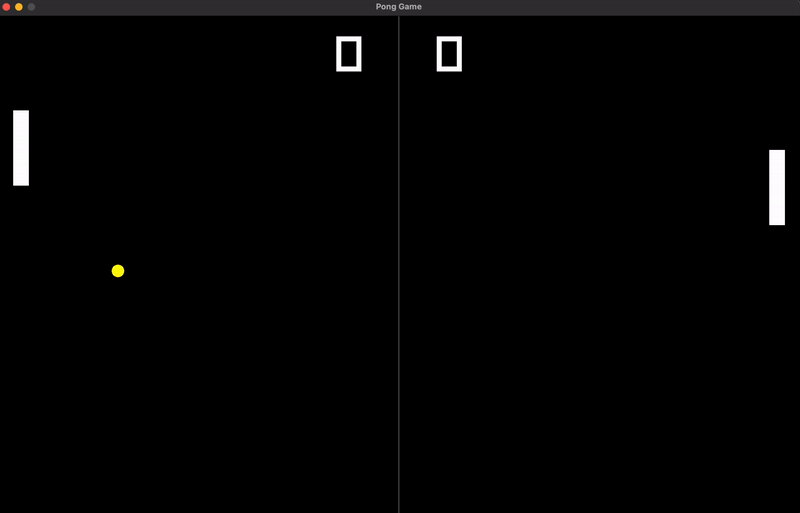

# **Pong Game**
This project is a replica of the classic Pong Game, originally developed in 1972. <br>
It has been implemented in C++ using the [raylib](https://www.raylib.com/) graphical library. <br>

## 🕹️ **Usage**
To play this game you can use the `make run` command. <br>
This rule will generate a `pong` file, which is the zipped version of the game. <br>
You can launch the executable by running the command `./pong` <br>
This project currently supports only **Mac** and **Linux** platforms.

## 🎥 **Demo**

<p align="center">
  
</p>

## 🧬 **Cloning**

To successfully clone this repository, use this command

```shell
git clone https://github.com/maricard18/pong-game.git
```

## Contributing

Contributions are welcome! Feel free to submit bug reports, feature requests, or pull requests through GitHub.

---
> Feel free to ask me any questions through Slack (**maricard**). <br>
> GitHub [@maricard18](https://github.com/maricard18) &nbsp;&middot;&nbsp;
> Linkedin [Mario Henriques](https://www.linkedin.com/in/mario18) &nbsp;&middot;&nbsp;
> [42 Porto](https://www.42porto.com/en)
